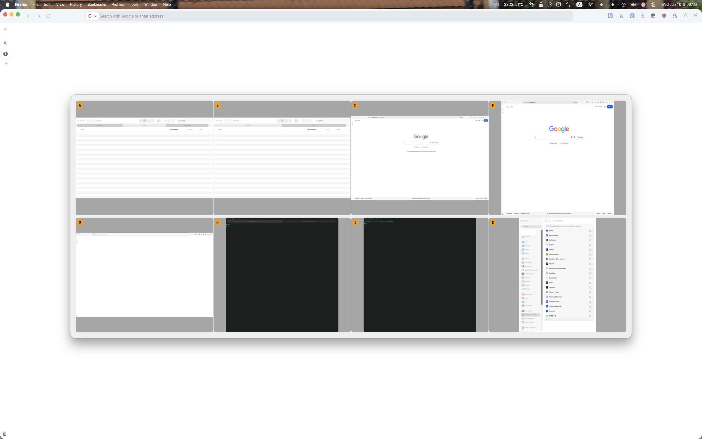

# Yo Window Switcher

A keyboard-driven window switcher for macOS. Press a hotkey to bring up a floating frosted-glass panel showing all open windows with Vimium-style hint labels — press the hint key to switch to that window instantly.

## How It Works

1. Press **Option+w** (customizable) to open the switcher panel
2. Each open window gets a hint key label (A, S, D, F, ...)
3. Press the hint key to switch to that window
4. Press **Escape** or hotkey to dismiss

## Features

- **Window thumbnails** — real window previews
- **Per-window switching** — each on-screen window gets its own entry
- **Dynamic column layout** — 2 to 6 columns, automatically chosen to maximize thumbnail size while filling the panel
- **Floating frosted-glass panel** — centered, 80% width, 90% height
- **Vimium-style hints** — home row keys first for fastest reach
- **Customizable hotkey** — record any key combination in Preferences
- **Launch at Login** — toggle in the menu bar
- **Conflict detection** — warns if shortcut conflicts with system shortcuts
- **Menu bar only** — no Dock icon, always running, lightweight
- **Universal binary** — works on Apple Silicon and Intel Macs

## Permissions

- **Screen Recording** — required for live window previews
- **Accessibility** — required for per-window switching (brings the specific window to front)

## Requirements

- macOS 14 (Sonoma) or later

## Installation

1. Open the DMG
2. Drag **Yo Window Switcher** to the **Applications** folder
3. Launch from Applications
4. Grant Screen Recording and Accessibility permissions when prompted

## Usage

| Action | Shortcut |
|--------|----------|
| Open window switcher | Option+w |
| Switch to window | Press the hint key |
| Dismiss panel | Escape/hotkey |
| Preferences | Menu bar → Preferences... |

## Version History

**0.5** — Dynamic 2-6 column layout, fixed 90% panel height, larger hint badges  
**0.2** — per-window switching, 4-column auto-sizing grid  
**0.1** — Initial release
